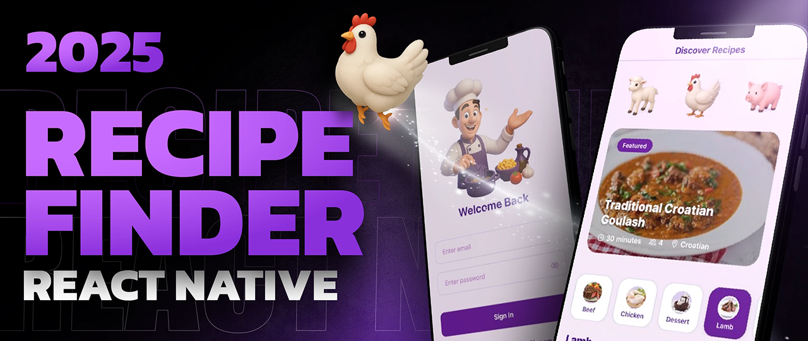

A beautiful recipe discovery app with authentication, search, and video tutorials - built with **React Native** and **Clerk**.


---

## 🔐 Key Features

### Authentication
- **Secure Signup & Login** using Clerk
- **6-Digit Email Verification** for account security
- **Profile Management** to view account details

### Recipe Discovery
- **🍳 Browse Featured Recipes** on the home screen
- **🔍 Search Recipes** by name or ingredients
- **📁 Filter by Categories** like vegetarian, desserts, etc.
- **🎥 Video Tutorials** embedded from YouTube

### Recipe Details
- **📝 Step-by-Step Cooking Instructions**
- **⏱️ Prep Time & Serving Size** info
- **📋 Ingredient Lists** with measurements
- **🎬 Embedded YouTube Videos** for visual learning

### Customization
- **🌈 8 Color Themes** to match your mood
- **🌙 Dark/Light Mode** support

---

## 🛠️ Technologies Used

- **Frontend**: React Native (Expo)
- **Authentication**: Clerk
- **Recipe API**: TheMealDB API
- **Styling**: React Native `StyleSheet` with dynamic theming
- **Video**: React Native WebView for YouTube embeds

---

## 🆓 Free & Open

This app uses 100% free services:
- Clerk free tier for authentication
- TheMealDB free API for recipes
- No paid dependencies

---

## 🚀 Getting Started

### Prerequisites

- Node.js >= 16
- Expo CLI:  
  ```bash
  npm install -g expo-cli
